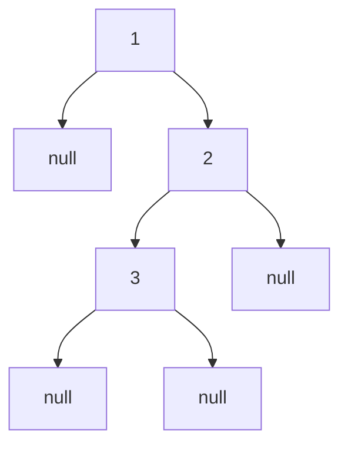

# Binary Tree Inorder Traversal

- [Problem No-94](https://leetcode.com/problems/binary-tree-inorder-traversal/)
- **Difficulty:** Easy

## Problem Statement

Given the `root` of a binary tree, return the inorder traversal of its nodes' values.

## Visual Representation


**Inorder Traversal:** 1 → 3 → 2

## Approach

- **Inorder Traversal:**  
  Visit the left subtree, then the root node, then the right subtree.
- **Recursive Implementation:**  
  - If the current node is `null`, return.
  - Recursively traverse the left subtree.
  - Add the current node's value to the result.
  - Recursively traverse the right subtree.
- **Result:**  
  Collect the values in a vector and return it after traversal.


## Example

**Input Tree:**
```
    1
     \
      2
     /
    3
```

**Output:**
```
1 3 2
```
