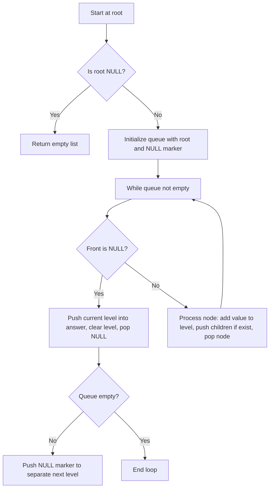

# Binary Tree Level Order Traversal

- [Problem No-701](https://leetcode.com/problems/binary-tree-level-order-traversal/)
- **Difficulty:** Medium

## Problem Statement

Given the root of a binary tree, return the level order traversal of its nodes' values. (i.e., from left to right, level by level).

## Visual Representation (flowchart)



## Detailed Approach

- Use Breadth-First Search (BFS) with a queue to process nodes level by level.
- Push the root and a level separator (NULL) into the queue.
- Maintain a temporary vector for the current level.
- While the queue is not empty:
  - If front is NULL:
    - Push the current level into the answer, clear the level.
    - Pop the NULL and, if queue not empty, push another NULL to mark the next level.
  - Otherwise:
    - Add node's value to the current level.
    - Push node's left and right children if they exist.
    - Pop the node.
- Return the list of levels when finished.

Alternate (preferred) approach: avoid NULL markers by using queue size:
- While queue not empty:
  - size = queue.size()
  - loop size times: pop node, record value, push children
  - push recorded level to answer

## Complexity

- Time: O(n), where n is number of nodes (each node visited once).
- Space: O(n) for the queue and answer (worst case).

---

## Example

Input tree:
```
    3
   / \
  9  20
     / \
    15  7
```

Output:
```
Level Order Traversal:
3
9 20
15 7
```

---