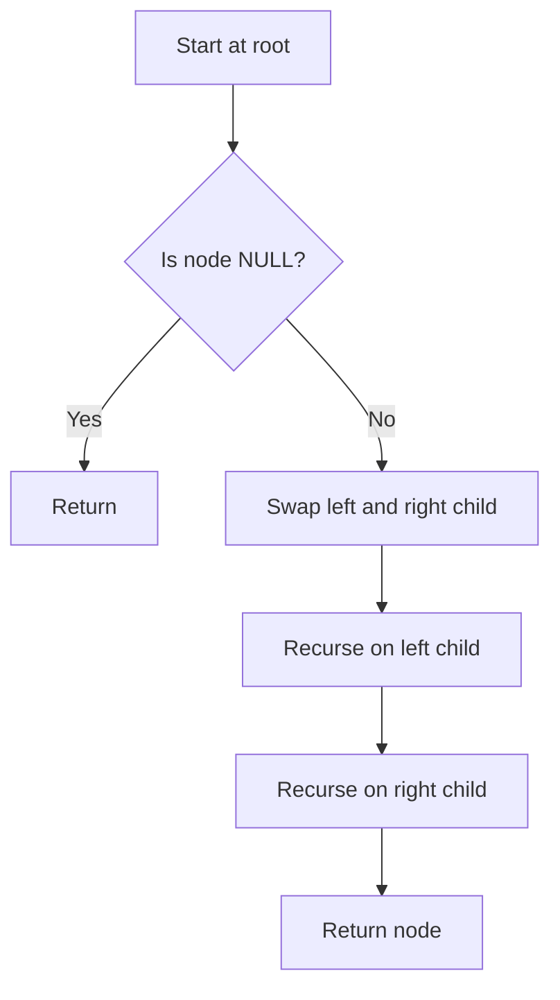

# Invert Binary Tree

-  [Problem No-226](https://leetcode.com/problems/invert-binary-tree/)
- **Difficulty:** Easy

## Problem Statement

Given the root of a binary tree, invert the tree and return its root. Inverting a binary tree means swapping the left and right children of every node.

## Visual Representation



---

## Detailed Approach

- Recursive idea:
  1. Base case: if node is null, return.
  2. Swap the left and right child pointers of the current node.
  3. Recursively invert the left subtree (originally right).
  4. Recursively invert the right subtree (originally left).
  5. Return the root of the inverted subtree.

- Key points:
  - Swap before recursion so children are inverted in-place.
  - Works in O(n) time visiting each node once.

## Complexity

- Time: O(n), where n is the number of nodes.
- Space: O(h) for recursion stack, where h is tree height (O(n) worst-case).

---

## Example

Input tree:
```
    4
   / \
  2   7
 / \ / \
1  3 6  9
```

Inverted tree:
```
    4
   / \
  7   2
 / \ / \
9  6 3  1
```

---