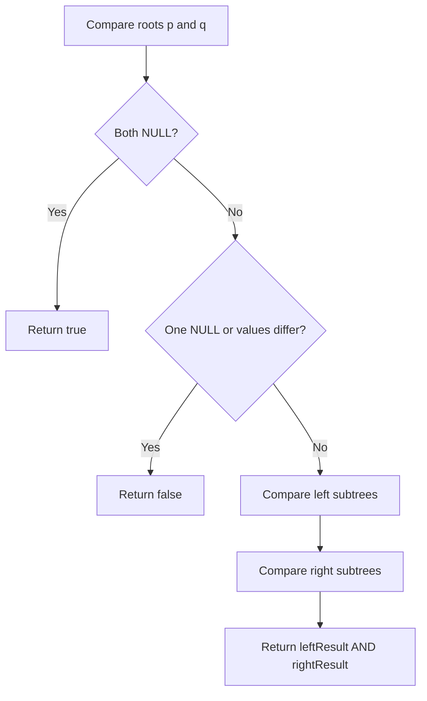

# Same Tree

-  [Problem No-100](https://leetcode.com/problems/same-tree/)
- **Difficulty:** Easy

## Problem Statement

Given the roots of two binary trees p and q, determine if they are the same. Two binary trees are considered the same if they are structurally identical and the nodes have the same values.

## Visual Representation



## Detailed Approach

- Recursive approach:
  1. If both nodes are null, they match => return true.
  2. If exactly one is null, or their values differ, return false.
  3. Recursively compare left children and right children.
  4. The trees are same if both left and right comparisons return true.

- Iterative alternative:
  - Use two synchronized queues/stacks; at each step pop a node from each, compare values and push children pairs. If mismatch, return false.

## Complexity

- Time: O(n) where n is the number of nodes in the smaller/compared portion (each node visited once).
- Space: O(h) recursion stack where h is tree height (O(n) worst-case). Iterative solution uses O(n) extra space.

---

## Example

Tree p:
```
    1
   / \
  2   3
```
Tree q:
```
    1
   / \
  2   3
```
Expected output from isSameTree(p, q): true

Tree r:
```
    1
   /
  2
```
isSameTree(p, r): false

---
